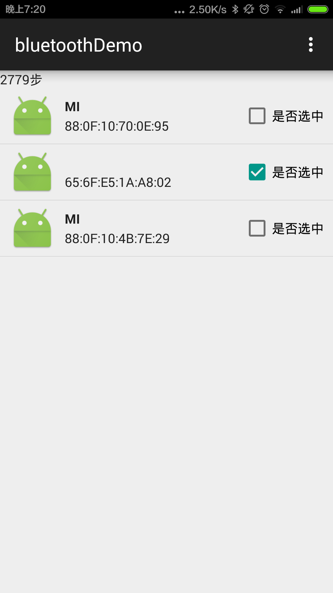

# bluetoothDemo
蓝牙低功耗（BLE）的demo

###工具类
```java
package com.zsl.bluetoothdemo.ble;


import android.bluetooth.BluetoothAdapter;
import android.bluetooth.BluetoothDevice;
import android.bluetooth.BluetoothGatt;
import android.bluetooth.BluetoothGattCallback;
import android.bluetooth.BluetoothManager;
import android.content.Context;
import android.content.Intent;
import android.os.Handler;
import java.util.ArrayList;
import java.util.List;

/**
 * 蓝牙的工具类
 * Created by zsl on 15/5/25.
 */


public class UniversalBluetoothLE {

    //UniversalBluetoothLE
    public static UniversalBluetoothLE universalBluetoothLE;

    private Context context;
    //BluetoothAdapter
    private BluetoothAdapter mBluetoothAdapter;
    //BluetoothManager
    private BluetoothManager bluetoothManager;

    //打开蓝牙的请求码
    public static final int REQUEST_ENABLE_BLUETOOTH = 10010;

    //是否正在扫描蓝牙设备
    private boolean mScanning;
    //设置扫描时长
    private static final long SCAN_PERIOD = 10000;

    //蓝牙扫描的返回
    BluetoothAdapter.LeScanCallback leScanCallback;
    //蓝牙设别的list
    List<BluetoothDevice> bluetoothDeviceList = new ArrayList<BluetoothDevice>();

    Handler mHandler = new Handler();

    LeScanListenter leScanListenter;

    private UniversalBluetoothLE(Context context) {
        this.context = context;
        //得到BluetoothManager
        this.bluetoothManager = (BluetoothManager) context.getSystemService(Context.BLUETOOTH_SERVICE);
        //得到BluetoothAdapter
        this.mBluetoothAdapter = bluetoothManager.getAdapter();

        //蓝牙搜索的回调
        leScanCallback = new BluetoothAdapter.LeScanCallback() {

            @Override
            public void onLeScan(BluetoothDevice device, int rssi, byte[] scanRecord) {
                bluetoothDeviceList.add(device);

                //返回所有列表
                leScanListenter.leScanCallBack(bluetoothDeviceList);

            }
        };
    }

    /**
     * 获得到UniversalBluetoothLE对象
     *
     * @param context
     * @return
     */
    public static UniversalBluetoothLE inistance(Context context) {
        if (universalBluetoothLE == null) {
            universalBluetoothLE = new UniversalBluetoothLE(context);
        }
        return universalBluetoothLE;
    }

    /**
     * 检查蓝牙是否打开并且启动打开蓝牙的方法
     */
    public void openBbletooth() {
        //判断蓝牙是否开启
        if (mBluetoothAdapter == null || !mBluetoothAdapter.isEnabled()) {
            //打开蓝牙
            Intent enableIntent = new Intent(BluetoothAdapter.ACTION_REQUEST_ENABLE);
            context.startActivity(enableIntent);
        }
    }

    /**
     * 开始（true）或结束（false）蓝牙扫描
     *
     * @param enable
     */
    private void scanLeDevice(final boolean enable) {
        if (enable && mScanning == false) {
            mHandler.postDelayed(new Runnable() {
                @Override
                public void run() {
                    mScanning = false;
                    mBluetoothAdapter.stopLeScan(leScanCallback);
                }
            }, SCAN_PERIOD);

            mScanning = true;
            mBluetoothAdapter.startLeScan(leScanCallback);
        } else {
            mScanning = false;
            mBluetoothAdapter.stopLeScan(leScanCallback);
        }
    }

    /**
     * 开始搜索蓝牙设备
     *
     * @param leScanListenter 搜索蓝牙设备的回调（返回设备列表）
     */
    public void startScanLeDevice(final LeScanListenter leScanListenter) {
        bluetoothDeviceList.clear();
        this.leScanListenter=leScanListenter;
        scanLeDevice(true);
    }

    /**
     * 停止搜索设备
     */
    public void stopScanLeDevice() {
        if (leScanCallback == null)
            return;
        scanLeDevice(false);
    }

    /**
     * 搜索蓝牙的回调
     */
    public interface LeScanListenter {
        void leScanCallBack(List<BluetoothDevice> bluetoothDeviceList);
    }

    /**
     * 得到BluetoothGatt
     * @param device 设备
     * @param autoConnect 是否自动链接
     * @param bluetoothGattCallback 回调
     */
    public BluetoothGatt getConnectGatt(BluetoothDevice device,boolean autoConnect,BluetoothGattCallback bluetoothGattCallback){
        return device.connectGatt(context, autoConnect, bluetoothGattCallback);
    }


}

```

> 初始化
```java
//在onCreate中
//初始化UniversalBluetoothLE
universalBluetoothLE = UniversalBluetoothLE.inistance(MainActivity.this);
```

> 检测是否打开蓝牙并且请求系统打开蓝牙
```java
//检测是否打开蓝牙并且请求系统打开蓝牙
universalBluetoothLE.openBbletooth();
```

> 链接设备

```java
mBluetoothGatt=universalBluetoothLE.getConnectGatt(device,true,mGattCallback);
mBluetoothGatt.connect();
```

###效果


